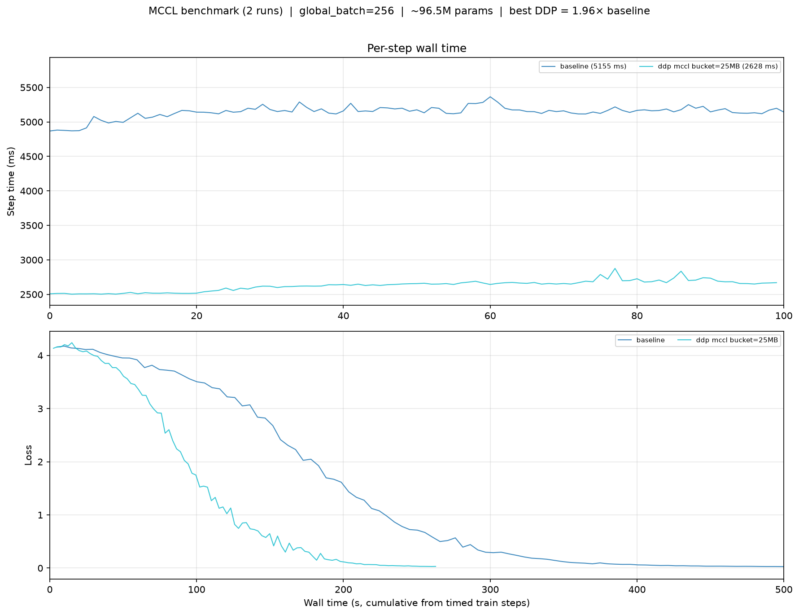
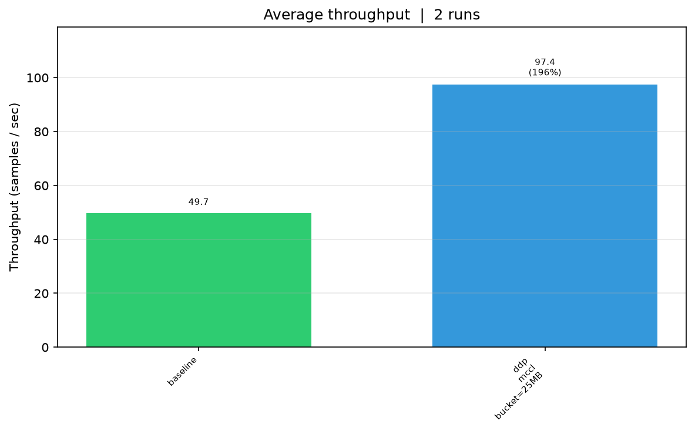

# MCCL Benchmark

Many thanks to [@mps-ddp](https://github.com/mps-ddp) for creating [mccl](https://github.com/mps-ddp/mccl), a collective communication library for apple silicon. This repository benchmarks `mccl` on two Mac Mini M4 (24gb + 16gb). The following figures are the results of the benchmark.

> only `DPP` has been tested, `FSDP` benchmarks are on the way.




## Setup

```bash
git clone https://github.com/nveshaan/mccl_benchmark.git
cd mccl_benchmark
uv sync

mkdir -p bench_runs
```

## Run

**DDP**
```bash
# Single-GPU baseline (no torchrun needed)
python src/ddp_train.py --baseline --save-stats bench_runs/

# 2-rank DDP on one Mac with MCCL (default)
torchrun --nproc_per_node=2 --nnodes=1 --master_addr=127.0.0.1 --master_port=29500 \
    src/ddp_train.py --save-stats bench_runs/

# Same thing with Gloo for comparison
torchrun --nproc_per_node=2 --nnodes=1 --master_addr=127.0.0.1 --master_port=29500 \
    src/ddp_train.py --backend gloo --save-stats bench_runs/

# 2-node MCCL over Thunderbolt (node_rank=1 on the second device)
torchrun --nproc_per_node=1 --nnodes=2 --node_rank=0 \
    --master_addr=169.254.x.x --master_port=29500 \
    src/ddp_train.py --steps 100 --batch-size 128 --save-stats bench_runs/

# 2-node Gloo for comparison (CPU tensors) (node_rank=1 on the second device)
torchrun --nproc_per_node=1 --nnodes=2 --node_rank=0 \
    --master_addr=169.254.x.x --master_port=29500 \
    src/ddp_train.py --backend gloo --steps 100 --batch-size 128 --save-stats bench_runs/
```

**FSDP**
```bash
# 2-rank FSDP on one Mac with MCCL
torchrun --nproc_per_node=2 --nnodes=1 --master_addr=127.0.0.1 --master_port=29500 \
    src/fsdp_train.py --save-stats bench_runs/

# 2-node FSDP setup over a physical Thunderbolt bridge
# Run on Mac 0 (Master Node):
torchrun --nproc_per_node=1 --nnodes=2 --node_rank=0 \
    --master_addr=169.254.x.x --master_port=29500 \
    src/fsdp_train.py --save-stats bench_runs/

# Run on Mac 1 (Worker Node):
torchrun --nproc_per_node=1 --nnodes=2 --node_rank=1 \
    --master_addr=169.254.x.x --master_port=29500 \
    src/fsdp_train.py
```

Then plot,
```bash
python src/plot.py bench_runs/ -o bench
```

## Conclusion

For optimizing the performance of `mccl`, refer to the [docs](https://github.com/mps-ddp/mccl/blob/master/docs/MULTINODE.md).